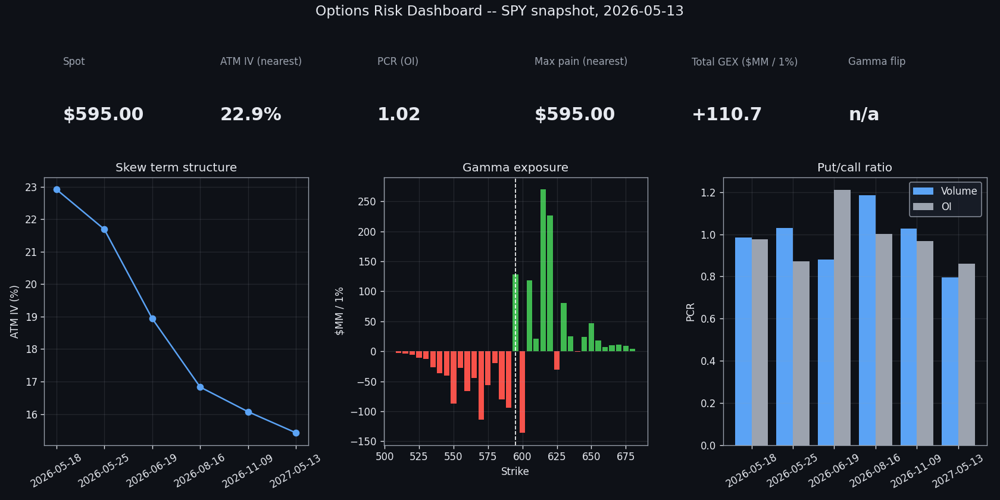

# Options Risk Dashboard

A Streamlit app and methodology notebook for multi-source options-chain analytics. The engine pulls full chains for any US-listed ticker, recomputes Black-Scholes pricing and seven Greeks from scratch, validates the data across providers, and surfaces eleven institutional-style views: IV surface, per-strike Greeks, 25-delta skew, max pain, gamma exposure under the SqueezeMetrics convention, the Breeden-Litzenberger implied PDF, pin-risk scores, and a multi-leg strategy builder.

## About

Research and educational tool, not investment advice. The author is the sole maintainer; calculations are independent re-implementations of textbook formulas validated against the `py_vollib` reference oracle in tests.

## Live demo

[Live demo](DEPLOY_URL_PLACEHOLDER) on Streamlit Community Cloud.

[](https://colab.research.google.com/github/alexeyklek10/Options_Risk_Dashboard/blob/main/notebooks/methodology.ipynb)

## Sample output

`images/dashboard_hero.png` is the headline KPI strip plus three at-a-glance panels (skew term structure, per-strike gamma exposure, put-call ratio per expiry) generated from a SPY-like snapshot.

`images/iv_surface_spy.png` is the call-side implied-volatility surface across the listed strike and DTE grid, interpolated with `scipy.interpolate.griddata` cubic and filled with nearest-neighbor outside the convex hull.

`images/gex_spy.png` is the per-strike gamma exposure under the SqueezeMetrics dealer-sign convention. Negative cluster left of spot is the protective-put OI; positive cluster right of spot is the covered-call / upside-speculation OI. The gamma-flip strike is the crossover from net-negative to net-positive cumulative GEX walking down from the highest strike.



## Features

Eleven tabs in the Streamlit app, each backed by a pure-function analytic in `src/ord/analytics/`:

* **Overview.** KPI tiles: spot, ATM IV (nearest and approx-30D), expected move from the ATM straddle, put-call ratio, max pain, total GEX, gamma flip. Plain-English summary paragraph auto-generated from the metrics.
* **IV surface.** 3D regular-grid surface plus per-expiry 2D smile dropdown.
* **Greeks.** Per-strike heatmaps for delta, gamma, vega, theta, vanna, and charm.
* **Skew and PCR.** ATM IV term structure with 25-delta risk reversal overlay; put-call ratio by volume and OI per expiry; aggregate tiles.
* **Max Pain / OI.** Per-expiry max-pain bars with spot and pin markers; per-side strike-by-expiry open-interest heatmaps.
* **GEX.** Per-strike dollar GEX bars colored by sign; cumulative GEX line with the gamma-flip strike annotated; spot vs flip distance tile.
* **IV vs RV.** 21-day close-to-close realized vol vs ATM IV of the nearest expiry past 21 DTE, with a regime callout.
* **Implied PDF.** Breeden-Litzenberger risk-neutral density per expiry, with a smoothing-spline slider and an arbitrage warning when the fitted density goes non-positive.
* **Pin risk.** Top-10 pin candidates for the selected expiry, scored by distance-to-spot, OI decile, and gamma-flip proximity.
* **Strategy builder.** Preset multi-leg positions (long call, long put, vertical, iron condor) with P&L-at-expiry line, P&L surface across spot and time, breakevens, max profit/loss, and aggregate position Greeks.
* **Data quality.** Cross-source disagreement aggregates by provider pair, top-20 strikes by IV disagreement, and a histogram of |provider IV - recomputed IV| for solver calibration.

## Methodology

* **Hand-rolled Black-Scholes-Merton pricer.** Closed-form European-option prices with continuous dividend yield `q` (Black & Scholes 1973, Merton 1973). Validated against `py_vollib.black_scholes_merton` on a 1024-point Sobol grid over `(S, K/S, T, r, sigma, q)` to within `1e-8` absolute. py_vollib is a test-only dependency; it is not imported anywhere in `src/`.
* **Seven Greeks per BSM.** delta, gamma, vega, theta, rho, vanna, charm. Scalar and vectorized implementations; closed forms for vanna `-exp(-qT) * phi(d1) * d2 / sigma` and charm. The five textbook Greeks match `py_vollib.black_scholes_merton.greeks.analytical` to `1e-6` after unit rescaling; vanna and charm are validated against central-difference numerical derivatives.
* **Manaster-Koehler initial guess + Newton-Raphson on vega + Brent fallback.** Initial `sigma0 = sqrt(|ln(S/K) + r*T| * 2 / T)` clamped to `[0.05, 2.0]` (Manaster & Koehler 1982). Newton converges on the change in `sigma` rather than the price residual to avoid flat-vega-region false convergence; Brent's method on `[1e-6, 5.0]` catches divergence cases. Round-trip recovers `sigma` to `1e-6` across every cell where true vega exceeds `1e-4`.
* **Multi-source chain aggregation.** Three providers behind a single ABC (`yfinance` always available; `Tradier` and `Polygon` self-enable when `TRADIER_TOKEN` / `POLYGON_API_KEY` are set). Per-provider fetches fan out in a `ThreadPoolExecutor`; rate-limit errors (HTTP 429) skip the offending provider and continue. The consensus chain is median IV per `(expiry, strike, type)` across providers.
* **Cross-source validator.** For every contract present in at least two providers, reports the IV range, mid range, OI range, and the calibration residual `|median provider IV - recomputed IV|` where the recomputed IV comes from feeding the median mid through the hand-rolled solver. Surfaces aggregate disagreement by provider pair.
* **IV surface.** Observed-scatter to regular-grid via `scipy.interpolate.griddata` cubic, with nearest-neighbor fill outside the convex hull and an extrapolation mask returned alongside.
* **25-delta skew.** 25-delta strikes located by interpolating |delta| against strike (rather than rounded to the nearest listed strike), so the metric is comparable across expiries with different listed grids. Returns ATM IV, 25Δ risk reversal `IV(25dC) - IV(25dP)`, 25Δ butterfly `(IV(25dC) + IV(25dP))/2 - ATM`, and the slope of IV vs `log(K/S)` in a ±10% window.
* **Max pain.** Per-expiry argmin over the strike grid of total dollar pain to option holders `100 * (sum_calls OI * max(K - K_i, 0) + sum_puts OI * max(K_j - K, 0))`. Pin folklore caveat is in the methodology notebook (Ni, Pearson & Poteshman 2005 find a small effect for some stocks; later studies weaker once delta-hedging flows are controlled for).
* **Gamma exposure under the SqueezeMetrics convention.** Per-strike `GEX_call = +gamma * OI * 100 * S^2 * 0.01`, `GEX_put = -gamma * OI * 100 * S^2 * 0.01`. Dealers assumed short calls, long puts. Positive total GEX implies a long-gamma regime (dampened realized vol); negative implies short-gamma (amplified vol). Gamma-flip strike is the cumulative-GEX zero-crossing walking down from the highest strike.
* **Breeden-Litzenberger implied PDF.** Risk-neutral density `f(K) = exp(r*T) * d^2C/dK^2` (Breeden & Litzenberger 1978). Implemented as a univariate smoothing spline on the call-price-vs-strike curve, analytical second derivative, normalisation over the strike grid, with a warning when the fitted density is non-positive at any point (arbitrage in the input price quotes).
* **Earnings-vol decomposition.** Standard two-equation term-structure split (Sinclair 2013, ch. 11): solves post-event steady-state variance from two post-announcement expiries, then backs out event variance. The BUILD_PROMPT-spec formula `sqrt((IV_pre^2 * T_pre - IV_post^2 * T_post) / T_event)` evaluates to `sqrt(NEGATIVE)` for any realistic post-event vol crush and is replaced; see the docstring in `src/ord/analytics/earnings_crush.py`.
* **Risk-free rate fetcher with zero-secret fallbacks.** Primary: `yfinance ^IRX` (13-week T-bill, divided by 100). Optional: FRED `DGS3MO` if `FRED_API_KEY` is set. Fallback: hardcoded `0.04` with a one-time logged warning. No API keys required for full functionality.

## How to run

### Local

```
git clone https://github.com/alexeyklek10/Options_Risk_Dashboard.git
cd Options_Risk_Dashboard
python -m venv .venv
.venv/Scripts/activate              # Windows
# or: source .venv/bin/activate     # macOS / Linux
pip install -r requirements.txt
streamlit run streamlit_app.py
```

Open the URL Streamlit prints (default `http://localhost:8501`). Enter a ticker in the sidebar; the default is `SPY`. The first chain fetch takes a few seconds via `yfinance`; subsequent runs hit the 15-minute parquet cache under `data/cache/`.

### Colab

The methodology notebook opens via the badge above. The first cell handles the `pip install` and the small `_testcapi` shim needed to import `py_vollib` on CPython 3.11+ distributions that lack the private test module (notably the python.org Windows installer).

### Docker

```
docker build -t options-risk-dashboard .
docker run --rm -p 8501:8501 options-risk-dashboard
```

The image is `python:3.11-slim` final, exposes port 8501, and runs the same `streamlit run streamlit_app.py` as the local path.

## Configuration

Environment variables (all optional):

| Variable | Purpose |
| --- | --- |
| `TRADIER_TOKEN` | Enable the Tradier provider (sandbox by default). |
| `TRADIER_PRODUCTION` | Set to `true` to use Tradier's production base URL. |
| `POLYGON_API_KEY` | Enable the Polygon.io provider. |
| `FRED_API_KEY` | Use FRED `DGS3MO` for the risk-free rate instead of `yfinance ^IRX`. |
| `ORD_INTEGRATION` | Set to `1` to run the opt-in live-provider integration tests locally. |

The dashboard works fully without any of these via the yfinance default path; the Tradier / Polygon paths self-disable on missing credentials and the aggregator silently skips them.

## Interpretation guide

| Metric | What it means | Typical / good values |
| --- | --- | --- |
| ATM IV (nearest) | Implied vol at K = spot, interpolated across listed strikes | SPY: 12 to 25% calm regime; 30%+ stressed |
| ATM IV (~30D) | Same, picked from the expiry whose DTE is closest to 30 | Reference quote for VIX-style monthly comparison |
| Expected move | `0.85 * ATM_straddle_mid` per expiry | Implied ±1σ range to the option's expiry |
| 25-delta risk reversal | `IV(25d_call) - IV(25d_put)` | SPY typically negative (puts richer than calls). > 0 signals upside chase. |
| 25-delta butterfly | `(IV(25d_call) + IV(25d_put))/2 - ATM` | Positive = wings bid relative to ATM; excess-kurtosis priced in. |
| PCR (volume) | Aggregate put volume / call volume | < 0.7 bullish, 0.7 to 1.0 balanced, > 1.0 bearish or hedging-heavy |
| PCR (open interest) | Same but on OI | Slower-moving positioning signal |
| Max pain (nearest) | Strike that minimizes total OI-weighted dollar pain | Folk-pinning marker; not a forecast |
| Total GEX ($MM / 1%) | Net dealer gamma exposure across all strikes | > 0: long-gamma, dampened vol. < 0: short-gamma, amplified vol. |
| Gamma flip | Cumulative-GEX zero crossing walking down from top strike | Spot below the flip is the canonical short-gamma regime warning |
| IV - RV21 spread | ATM IV (>= 21 DTE) minus 21-day realized vol | > 0: vol-sellers favored. < 0: vol-buyers favored. |
| Pin-risk score | 0 - 100 composite of distance / OI decile / gamma-flip proximity | Top candidates worth attention in last-week pinning analysis |

## Limitations

A few caveats worth flagging before reading too much into any single number.

* **European-option assumption on American equity options.** US-listed equity options are American-style; we use Black-Scholes-Merton (European) throughout. The approximation is reasonable for non-dividend payers and near-the-money strikes and breaks down for deep ITM puts on dividend payers and around ex-dividend dates. A full pricer would need binomial / Bjerksund-Stensland; out of scope for this repo.
* **Continuous dividend yield from trailing data.** The dashboard takes `yfinance.Ticker.info['dividendYield']` (annualised) and treats it as continuous `q`. Fine for steady payers, breaks around special dividends and around recent dividend initiations or cuts. The error feeds straight through into the recomputed IVs for deep ITM cases.
* **Risk-free rate is a single point.** The default path uses `yfinance ^IRX / 100` (or optional FRED `DGS3MO`, or `0.04` fallback), not a per-expiry rate from the OIS curve. The error is 1-3 bp on typical SPY-like names and bigger for very long-dated options where the curve has more slope.
* **GEX dealer sign convention is an assumption, not a measurement.** The SqueezeMetrics "dealers short calls, long puts" convention fits retail-flow-dominated underliers like SPY reasonably well, but it can be wildly wrong on individual single names where dealers run idiosyncratic books. Treat the gamma-flip level as a positioning indicator, not as a price target.
* **Earnings-crush formula deviation from the spec.** The original BUILD_PROMPT formula `sqrt((IV_pre^2 * dte_pre - IV_post^2 * dte_post) / dte_event)` evaluates to `sqrt(NEGATIVE)` for any realistic post-event vol crush (`IV_pre > IV_post`, `dte_pre < dte_post`). We implement the standard two-equation decomposition documented in Sinclair (2013, ch. 11) instead, where post-event steady-state variance is solved first and event variance is backed out. The replaced formula is called out in `src/ord/analytics/earnings_crush.py` and again in the methodology notebook.
* **Breeden-Litzenberger PDF is sensitive to the smoothing-spline parameter.** On wide-bid-ask or sparse-strike chains the second derivative of the call curve amplifies any noise in the inputs. The dashboard exposes a smoothing slider; the methodology default is `s = 0` (interpolating spline) which is right for clean BS-generated prices but noisy on illiquid names.
* **yfinance data quality is uneven.** Vendor-stale fields (zero OI, NaN IV at `1e-5`) are common on weeklies, on deep-OTM strikes, and outside US market hours. The package leaves them as `None` rather than imputing; downstream analytics that need OI or IV (max-pain, GEX, smile) effectively skip those rows.
* **The methodology notebook's worked example uses a synthetic SPY-like chain.** The fixture at `notebooks/fixtures/spy_chain_*.parquet` is generated from first principles via Black-Scholes-Merton (see `.build_fixture.py`) so the README screenshots and notebook outputs are deterministic. The notebook's final cell shows the one-line swap to today's live yfinance chain.

## Development

```
# One-time: set up the venv and pre-commit hooks.
python -m venv .venv
.venv/Scripts/activate                      # Windows
pip install -r requirements-dev.txt
pip install -e .
.venv/Scripts/pre-commit install

# Quality gate (matches CI):
.venv/Scripts/ruff check .
.venv/Scripts/black --check .
.venv/Scripts/mypy src/
.venv/Scripts/pytest                        # 229 tests, ~12s
```

Test coverage by module: pricing 100%, analytics 99%, data 99%, utils 84-100%. Tradier and Polygon integration tests are gated by `pytest.mark.skipif` on their env vars (skipped in CI without credentials). The cross-source validator is fully unit-tested with checked-in per-provider fixtures.

The build helpers `.build_fixture.py`, `.build_notebook.py`, and `.build_images.py` regenerate the methodology fixture, the notebook itself, and the README PNGs respectively. They are excluded from the linter config and meant to be re-run when the underlying artifacts need refreshing.

## License

MIT. See [`LICENSE`](LICENSE).
